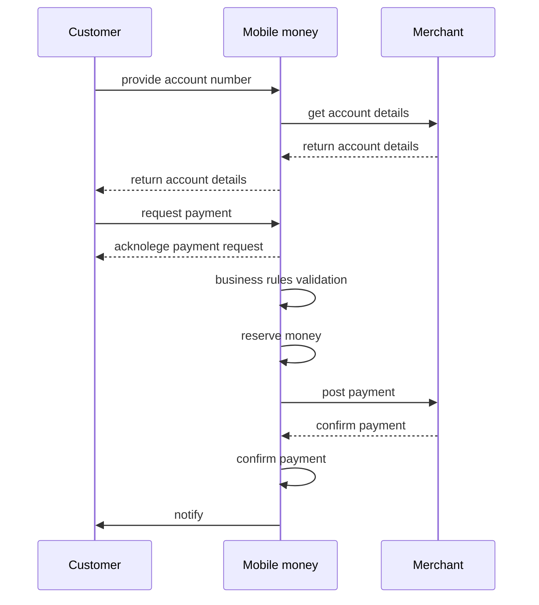

# 1. Introduction
The following functionalities using are available:
- Account verification
- Payment processing
- Transaction inquiry

# 2. Authentication
- A static API token {{API_TOKEN}} is used for authorization
- Authorization: Bearer {{API_TOKEN}}

# 3. Content Type Headers
All requests must include the following headers:
- Content-Type: application/json
- Accept: application/json

# 4. Response Codes and Handling
- API responses will only use HTTP_200 status code.
- Success or failure will be communicated within the status field of the response body.
- Error codes are not used in this API. Any reponse HTTP error other than 200 will be considered as a malfunction and will be discarded

# 5. Response Structure
All responses will have the following structure:

```json
{
    "status": "string",
    "message": "string",
    "data": {} 
}
```

- status: Indicates the operation outcome ("SUCCESS" or "FAIL").
- message: Provides a human-readable description of the outcome.
- data: An optional object containing additional information specific to the API call.

# 6. API Endpoints
## 6.1. Validate Account Number
(Endpoint URL): {{url}}/api/search
(HTTP Method): POST

### (Request Body):

```json
{
  "account_id": "string"
}
```

- account_id: The account number to validate (required).


### (Success Response):
```json
{
  "status": "SUCCESS",
  "message": "Account found.",
  "data": {
    "account_name": "John Doe" 
  }
}
```
### (Fail Response):
```json
{
  "status": "FAIL",
  "message": "Account not found.",
  "data": {}
}
```

## 6.2. Payment
- (Endpoint URL): {{url}}/api/pay
- (HTTP Method): POST

 (Request Body):

```json
{
  "account_id": "string",
  "amount": "number",
  "mm_tid": "string"
}
```
- account_id: The account number to debit (required).
- amount: The payment amount in the specified currency (required).
- mm_tid: A unique reference ID for the transaction (required).


(Success Response):

```json
{
  "status": "SUCCESS",
  "message": "Payment processed successfully.",
  "data": {
    "merchant_tid": "123456"
  }
}
```

(Fail Response):

```json
{
  "status": "FAIL",
  "message": "Maximum balance reached",
  "data": {}
}
```


### 6.3. Transaction Enquiry
- (Endpoint URL): {{url}}/api/tpm/pay
- (HTTP Method): POST
- (Request Body):

```json
{
  "mm_tid": "string"
}
```

- mm_tid: The transaction reference ID to inquire about (required).


(Response):

```json
{
  "status": "SUCCESS",
  "message": "Transaction found.",
  "data": {
    "merchant_tid": "12345"
    }
}
```

# 7. Sequence

